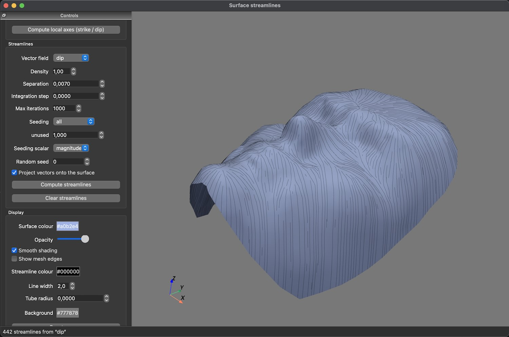

# Python binding for [Surface Streamlines](https://github.com/LookUpGeoscience/surface-streamlines)

<p align="center">
  
</p>

## Build

```bash
cmake -B build && cmake --build build -j10
./extern/rosetta/bin/rosetta_gen --build manifest.json -j10
```

## Testing

```bash
python3 scripts/plot.py data/face.ts -p dip --density 2

python3 scripts/plot.py data/feuille.ts -p strike --density 2 --tube 0.1

python3 scripts/plot.py extern/streamlines/data/Faults.ts -p U --density 2
```
